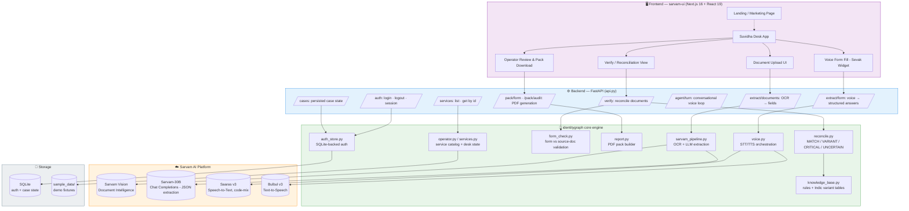
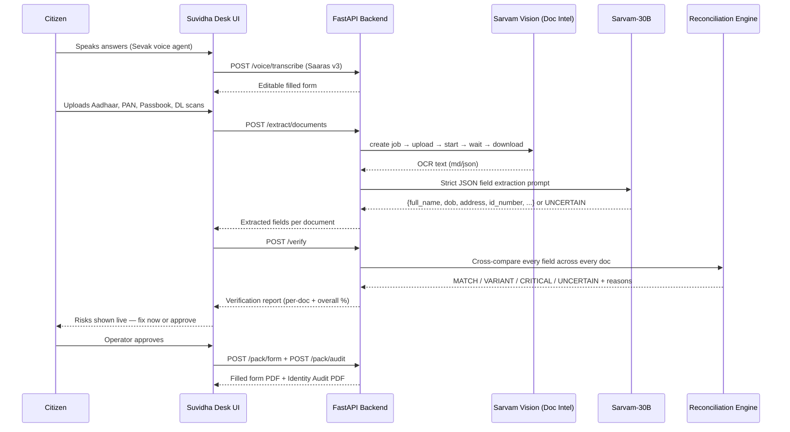

<div align="center">

# 🪪 IdentityGraph — Suvidha Desk

### AI-powered identity reconciliation for India's Common Service / Setu Suvidha Kendras

**Voice-fill the form → Digitize the documents → Reconcile identity across IDs → Operator approves → Portal-ready pack downloads**

[](#)
[](#)
[](#)
[](#)

</div>

## 🧩 Problem Statement

At every **Common Service Centre (CSC) / Setu Suvidha Kendra** in India, the same broken journey repeats itself thousands of times a day:

1. A citizen walks in to update a government record (Aadhaar ↔ mobile link, driving licence address, PAN, etc.).
2. They fill a **paper form by hand** — often struggling with block letters or language.
3. The operator manually **retypes** the same fields into Sarathi / UIDAI / tax portals.
4. **Nobody actually checks whether the citizen's own documents agree with each other.**
5. Days later, the **portal rejects** the application — "Mohd" vs "Mohammed", an old CIDCO address vs the new Aadhaar address — and the citizen has to return, and the desk starts all over again.

> **18%+** of identity-related application rejections happen because of *mismatched records*, not missing paperwork — and this is discovered **after the citizen has already left the desk.**

| Pain Point | Why it hurts |
|---|---|
| ✍️ Manual, illegible paper forms | Slows down every visit; error-prone transcription |
| 🔁 Duplicate data entry across portals | Operator re-types the same fields 2–3 times |
| 🕵️ No cross-document identity check | Name/DOB/address mismatches go undetected at the desk |
| 📮 Rejection discovered *after* upload | Citizen must return for a second visit, desk re-does the work |
| 🌐 Language & literacy barriers | Citizens who can't type or read English are underserved |

---

## 💡 Our Solution

**IdentityGraph Suvidha Desk** turns the operator's counter into an intelligent, voice-driven, self-verifying identity checkpoint — so the mismatch that would have rejected the application at the portal is caught **at the desk, in the same visit.**

```
Before:  Fill form → Upload documents → Wait days → ❌ Portal rejects → Citizen returns
After :  Fill form (voice-assisted) → Digitize documents → ✅ Risk flagged instantly → Fix or Pack → Done, same visit
```

The system:

1. **Lets the citizen speak instead of write** — a voice agent (Sevak) asks one question at a time in the citizen's language, transcribes the answer, and fills an **editable** form.
2. **Digitizes every supporting document** (Aadhaar, PAN, Voter ID, Driving Licence, Passbook, etc.) using OCR + LLM extraction, never guessing a field it isn't sure about.
3. **Cross-reconciles identity fields** (name, father's name, DOB, address, ID number) across every document using phonetic/Indic-variant matching, classifying every difference as:
   - ✅ `MATCH` — identical
   - 🟡 `VARIANT` — harmless spelling/format difference (e.g. Mohd vs Mohammed)
   - 🔴 `CRITICAL` — a real mismatch that will get the application rejected
   - ⚪ `UNCERTAIN` — needs a human to look, never silently assumed
4. **Routes each critical mismatch to the correct correction portal** (UIDAI, Parivahan Sarathi, Protean PAN, Passport Seva, etc.) with clear next steps.
5. **Keeps a human operator in the loop** — the operator reviews, approves, and downloads one clean pack: the **filled application form + an identity audit report**, ready to upload — or a clear fix-first checklist if not.

---

## ✅ Key Benefits

- 🎯 **Shift-left rejection detection** — the exact mismatch that would fail at the portal is now caught at the counter, in the same visit.
- 🗣️ **Voice-first accessibility** — citizens who can't type or read block letters can still complete the form by speaking, in Hindi/English code-mixed speech.
- 🧠 **No hallucinated data** — extraction always prefers `UNCERTAIN` over guessing a value it can't confirm.
- ⏱️ **~16 minutes saved per blocked case** vs discovering the same mismatch at Parivahan/UIDAI later.
- 👩‍💼 **Human-in-the-loop by design** — the operator always approves; the system assists, it doesn't auto-submit.
- 📦 **One usable output** — a portal-ready filled form + identity audit PDF, not just a chat transcript.
- 🌍 **Multi-lingual** — supports 12 Indian languages for both document OCR and voice interaction.
- 🏛️ **Portal-aware remediation** — tells the citizen exactly which government portal fixes which mismatch.

---

## 🏗️ Architecture Diagram



### Request lifecycle (Verify step, end-to-end)



---

## 🤖 Models & Sarvam APIs Used

| Stage | Sarvam Model / API | Purpose |
|---|---|---|
| 🗣️ Voice prompts | **Bulbul v3** (`text_to_speech.convert`) | Reads each form field aloud in Hindi/Indic languages |
| 👂 Voice answers | **Saaras v3** (`speech_to_text.transcribe`, `mode=codemix`) | Transcribes Hindi–English code-mixed speech into form answers |
| 📄 Document digitization | **Sarvam Vision — Document Intelligence** (job API: create → upload → start → wait → download) | Converts scanned Aadhaar/PAN/DL/Passbook images into machine-readable text |
| 🧾 Field extraction | **Sarvam-30B** (chat completions, strict JSON mode) | Extracts `full_name`, `father_name`, `dob`, `address`, `id_number` — returns `UNCERTAIN` instead of guessing |
| 🔍 Reconciliation | **Local engine** (`jellyfish` phonetic matching + Indic variant tables) | Classifies cross-document differences without any external API call |
| 📦 Portal pack | **Local PDF generation** (`fpdf2`) | Produces the filled application form + identity audit report |

**Language support:** English, Hindi, Marathi, Bengali, Tamil, Telugu, Kannada, Malayalam, Gujarati, Punjabi, Odia, Urdu.

---

## 🔬 Identity Reconciliation Engine

The core differentiator of this project — a **zero-API-call, deterministic reconciliation engine** (`identitygraph/reconcile.py`) that compares every identity field pairwise across all uploaded documents:

| Verdict | Meaning | Example |
|---|---|---|
| ✅ **MATCH** | Identical after normalization | `Ramesh Kumar` = `Ramesh Kumar` |
| 🟡 **VARIANT** | Same identity, harmless difference — safe to proceed | `Mohd` ≈ `Mohammed`, initials expansion, token reordering |
| 🔴 **CRITICAL** | Real mismatch — will get the application rejected | Old CIDCO address on DL vs new address on Aadhaar |
| ⚪ **UNCERTAIN** | A field is unreadable/missing on one side | Never silently counted as a match or a failure |

Every mismatch is paired with a **remediation route** — the exact government portal that fixes that document (UIDAI SSUP, Parivahan Sarathi, Protean PAN correction, Voter Service Portal, Passport Seva, etc.), so the operator or citizen knows precisely what to do next.

---

## 🛠️ Tech Stack

| Layer | Technology |
|---|---|
| **Frontend** | Next.js 16, React 19, TypeScript, Tailwind CSS 4, shadcn/ui, Base UI, Lucide icons |
| **Backend API** | FastAPI, Uvicorn, Pydantic |
| **AI / OCR / Voice** | Sarvam AI SDK — Document Intelligence, Sarvam-30B, Saaras v3, Bulbul v3 |
| **Matching engine** | `jellyfish` (Jaro-Winkler phonetic similarity), `python-dateutil` |
| **PDF generation** | `fpdf2` |
| **Auth / persistence** | SQLite (local, hashed credentials) |
| **Container** | Docker (`python:3.12-slim`) |
| **Legacy demo UI** | Streamlit (`app.py`) — quick click-through demo mode |

---

## 📁 Project Structure

```
identity-graph-main/
├── Sarvam_AI/                      # Python backend (FastAPI + core engine)
│   ├── api.py                      # FastAPI app — REST endpoints
│   ├── app.py                      # Streamlit demo app (legacy/quick demo)
│   ├── identitygraph/
│   │   ├── sarvam_pipeline.py      # Sarvam Vision + Sarvam-30B integration
│   │   ├── reconcile.py            # Cross-document identity reconciliation
│   │   ├── form_check.py           # Form-vs-document validation
│   │   ├── knowledge_base.py       # Domain rules & Indic variant tables
│   │   ├── report.py               # PDF pack generator (form + audit)
│   │   ├── operator.py             # Service catalog & desk orchestration
│   │   ├── services.py             # Service/document definitions
│   │   ├── auth_store.py           # SQLite-backed auth
│   │   ├── voice.py                # Saaras/Bulbul orchestration
│   │   └── config.py               # Fields, document types, remediation portals
│   ├── sample_data/                # Demo fixtures (offline-safe judging mode)
│   ├── tests/                      # Test suite
│   ├── requirements.txt
│   ├── Dockerfile
│   └── .env.example
│
├── sarvam-ui/                       # Next.js frontend
│   ├── src/app/                    # App router pages (landing, desk, login)
│   ├── src/components/
│   │   ├── marketing/               # Landing page sections
│   │   ├── desk/                    # Suvidha Desk workflow UI
│   │   ├── identity/                # Verification/reconciliation views
│   │   ├── shell/                   # Layout shell
│   │   └── ui/                      # shadcn/ui primitives
│   ├── src/lib/                    # API clients, desk state, identity helpers
│   └── package.json
│
└── DEMO_STORYLINE.md               # 3-minute demo script & narrative
```

---

## 🚀 Getting Started

### Prerequisites
- Python 3.12+
- Node.js 20+
- A [Sarvam AI](https://sarvam.ai) API key (for live OCR/voice — demo mode works without one)

### 1. Backend (FastAPI)

```bash
cd Sarvam_AI
python -m venv .venv && source .venv/bin/activate   # Windows: .venv\Scripts\activate
pip install -r requirements.txt
cp .env.example .env        # then add your Sarvam API_KEY
uvicorn api:app --reload --port 8001
```

Or with Docker:

```bash
cd Sarvam_AI
docker build -t identitygraph-api .
docker run -e API_KEY=sk-... -p 8001:8001 identitygraph-api
```

### 2. Frontend (Next.js)

```bash
cd sarvam-ui
npm install
npm run dev
```

Open **http://localhost:3000**.

### 3. (Optional) Streamlit quick-demo mode

```bash
cd Sarvam_AI
streamlit run app.py
```
Demo mode loads sample fixtures with one click — no API key or network risk during judging. Flip the sidebar toggle for live mode.

---

## 📡 API Reference

| Method | Endpoint | Description |
|---|---|---|
| `GET` | `/health` | Health check |
| `GET` | `/meta` | Metadata — supported fields, doc types, languages |
| `GET` | `/services` | List all supported desk services |
| `GET` | `/services/{service_id}` | Get a single service definition |
| `GET` | `/demo/{service_id}` | Load offline demo fixtures for a service |
| `POST` | `/extract/form` | Convert voice/typed answers into structured form data |
| `POST` | `/extract/documents` | OCR + LLM field extraction from uploaded documents |
| `POST` | `/verify` | Run cross-document identity reconciliation |
| `POST` | `/voice/speak` | Text-to-speech (Bulbul v3) |
| `POST` | `/voice/transcribe` | Speech-to-text (Saaras v3) |
| `POST` | `/agent/turn` | One turn of the conversational voice-fill agent |
| `POST` | `/pack/form` | Generate the filled application form PDF |
| `POST` | `/pack/audit` | Generate the identity audit PDF |
| `POST` | `/auth/login` / `POST /auth/logout` / `GET /auth/me` | Operator authentication |
| `GET` / `POST` | `/cases`, `/cases/{case_id}` | Persisted case state |

---

## 🎬 Demo Flow

1. **Pick the service** — e.g. "Driving Licence Address Update".
2. **Voice-fill the form** — Sevak asks one question at a time; the citizen answers by speaking; the form stays fully editable.
3. **Upload documents** — Aadhaar, PAN, Bank Passbook, Driving Licence scans.
4. **Verify** — see the live reconciliation report: overall match %, per-field verdicts, and flagged critical risks with the exact portal to fix them.
5. **Operator approves** — download the portal-ready pack: filled form + identity audit PDF.

> Full 3-minute demo script with timing and talking points: see [`DEMO_STORYLINE.md`](./DEMO_STORYLINE.md).

---

## 📊 Impact / Metrics

| Metric | Value |
|---|---|
| Identity-mismatch driven rejections (baseline) | **18%+** of cases |
| People typically touching a case before the portal | **2–3** |
| Return visits caused by late-discovered mismatch | **1 per blocked case** |
| Time saved per blocked case (desk vs portal discovery) | **~16 minutes** |
| Sample reconciliation accuracy (RTO demo case) | **92%** overall — 10 matched fields, 6 harmless variants, 2 critical risks caught before upload |

---

## 🗺️ Roadmap

- [ ] Expand Indic variant/phonetic tables for regional name conventions
- [ ] Add more government services beyond RTO / Aadhaar-mobile linking / schemes / grievances
- [ ] Multi-operator case queue & handoff
- [ ] Offline-first mode for low-connectivity kendras
- [ ] Analytics dashboard for kendra-level rejection trends

---

## 👥 Made By

<div align="center">

**Sanika Chavan** — [linkedin.com/in/sanika-chavan1806](https://www.linkedin.com/in/sanika-chavan1806/)
&nbsp;&nbsp;|&nbsp;&nbsp;
**Shubham** — [linkedin.com/in/shuence](https://www.linkedin.com/in/shuence/)

Feel free to connect with us on LinkedIn! 🤝

</div>
